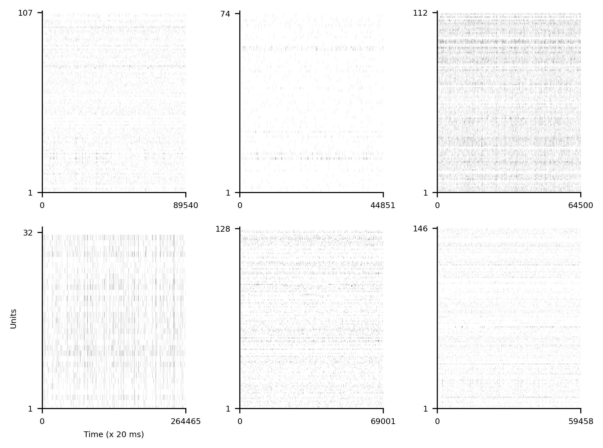

[](https://huggingface.co/datasets/eminorhan/neural-pile-primate)
[](https://opensource.org/licenses/MIT)

# Spiking neural activity data recorded from primates 

~34B uncompressed tokens of spiking neural activity data recorded from primates (tokens=neurons x time bins). Unless otherwise noted, the data consist of spike counts in 20 ms time bins recorded from each neuron. 

This repository contains the code and instructions for building the dataset from scratch. The actual final dataset is hosted at [this](https://huggingface.co/datasets/eminorhan/neural-pile-primate) public HF repository.

The current component datasets and token counts per dataset are as follows:

| Name               | Tokens          | Source                                                      | Details                        | Species  | Subjects | Sessions |
|:-------------------|----------------:|:------------------------------------------------------------|:-------------------------------|:---------|---------:|---------:|
| Xiao               | 17,695,820,059  | [dandi:000628](https://dandiarchive.org/dandiset/000628)    | [link](data/xiao)              | macaque  | 13       | 679      |
| Neupane (PPC)      | 7,899,849,087   | [dandi:001275](https://dandiarchive.org/dandiset/001275)    | [link](data/neupane-ppc)       | macaque  | 2        | 10       |
| Willett            | 1,796,119,552   | [dryad:x69p8czpq]( https://doi.org/10.5061/dryad.x69p8czpq) | [link](data/willett)           | human    | 1        | 44       |
| Churchland         | 1,278,669,504   | [dandi:000070](https://dandiarchive.org/dandiset/000070)    | [link](data/churchland)        | macaque  | 2        | 10       |
| Neupane (EC)       | 911,393,376     | [dandi:000897](https://dandiarchive.org/dandiset/000897)    | [link](data/neupane-entorhinal)| macaque  | 2        | 15       |
| Kim                | 804,510,741     | [dandi:001357](https://dandiarchive.org/dandiset/001357)    | [link](data/kim)               | macaque  | 2        | 159      |
| Even-Chen          | 783,441,792     | [dandi:000121](https://dandiarchive.org/dandiset/000121)    | [link](data/even-chen)         | macaque  | 2        | 12       |
| Papale             | 775,618,560     | [g-node:TVSD](https://gin.g-node.org/paolo_papale/TVSD)     | [link](data/papale)            | macaque  | 2        | 2        |
| Perich             | 688,889,368     | [dandi:000688](https://dandiarchive.org/dandiset/000688)    | [link](data/perich)            | macaque  | 4        | 111      |
| Wojcik             | 422,724,515     | [dryad:c2fqz61kb](https://doi.org/10.5061/dryad.c2fqz61kb)  | [link](data/wojcik)            | macaque  | 2        | 50       |
| Makin              | 375,447,744     | [zenodo:3854034](https://zenodo.org/records/3854034)        | [link](data/makin)             | macaque  | 2        | 47       |
| H2                 | 297,332,736     | [dandi:000950](https://dandiarchive.org/dandiset/000950)    | [link](data/h2)                | human    | 1        | 47       |
| Lanzarini          | 259,179,392     | [osf:82jfr](https://osf.io/82jfr/)                          | [link](data/lanzarini)         | macaque  | 2        | 10       |
| Athalye            | 101,984,317     | [dandi:000404](https://dandiarchive.org/dandiset/000404)    | [link](data/athalye)           | macaque  | 2        | 13       |
| M1-A               | 45,410,816      | [dandi:000941](https://dandiarchive.org/dandiset/000941)    | [link](data/m1-a)              | macaque  | 1        | 11       |
| M1-B               | 43,809,344      | [dandi:001209](https://dandiarchive.org/dandiset/001209)    | [link](data/m1-b)              | macaque  | 1        | 12       |
| H1                 | 33,686,576      | [dandi:000954](https://dandiarchive.org/dandiset/000954)    | [link](data/h1)                | human    | 1        | 40       |
| Moore              | 30,643,839      | [dandi:001062](https://dandiarchive.org/dandiset/001062)    | [link](data/moore)             | marmoset | 1        | 1        |
| Temmar             | 27,388,320      | [dandi:001201](https://dandiarchive.org/dandiset/001201)    | [link](data/temmar)            | macaque  | 1        | 12       |
| Rajalingham        | 14,923,100      | [zenodo:13952210](https://zenodo.org/records/13952210)      | [link](data/rajalingham)       | macaque  | 2        | 2        |
| DMFC-rsg           | 14,003,818      | [dandi:000130](https://dandiarchive.org/dandiset/000130)    | [link](data/dmfc-rsg)          | macaque  | 1        | 2        |
| M2                 | 12,708,384      | [dandi:000953](https://dandiarchive.org/dandiset/000953)    | [link](data/m2)                | macaque  | 1        | 20       |
| Area2-bump         | 7,394,070       | [dandi:000127](https://dandiarchive.org/dandiset/000127)    | [link](data/area2-bump)        | macaque  | 1        | 2        |

**Total number of tokens:** 34,320,949,010

The combined dataset takes up about 6 GB when stored as `.parquet` files and roughly 34 GB when stored as memory-mapped `.arrow` files (see [this](https://stackoverflow.com/a/56481636) for an explanation of the differences between these file formats). The HF `datasets` library uses `.arrow` files for local caching, so you will need at least this much free disk space in order to be able to utilize it. 

## Requirements
Please see the auto-generated [`requirements.txt`](requirements.txt) file.

## Creating the component datasets
The [`data`](data) directory contains all the information needed to download and preprocess the individual component datasets and push them to the HF datasets hub (quick links to the subdirectories for component datasets are provided in the Details column in the table above). You can use these as a starting point if you would like to add more datasets to the mix. Adding further `dandisets` should be particularly easy based off of the current examples. When creating the component datasets, we split long sessions (>10M tokens) into smaller equal-sized chunks of no more than 10M tokens. This makes data loading more efficient and prevents errors while creating and uploading HF datasets.

## Merging the component datasets into a single dataset
Once we have created the individual component datasets, we merge them into a single dataset with the [`merge_datasets.py`](merge_datasets.py) script. This also shuffles the combined dataset, creates a separate test split, and pushes the dataset to the HF datasets hub. If you would like to add more datasets to the mix, simply add their HF dataset repository names to the `repo_list` in `merge_datasets.py`.

### Note:
Running `merge_datasets.py` successfully requires a patch in the `huggingface_hub` library (as of version `0.29.1`; I haven't tested newer versions). The HF `datasets` library doesn't do retries while loading datasets from the hub (`load_dataset`) or when pushing them to the hub (`push_to_hub`). This almost always results in connection errors for large datasets in my experience, aborting the loading or pushing of the dataset. The patch involves adding a "retry" functionality to `huggingface_hub`'s default session backend factory. Specifically, you need to update the `_default_backend_factory()` function in `huggingface_hub/utils/_http.py` with:
```python
from requests.adapters import HTTPAdapter, Retry

...

def _default_backend_factory() -> requests.Session:
    session = requests.Session()
    retries = Retry(total=20, backoff_factor=0.1, status_forcelist=[500, 502, 503, 504])
    if constants.HF_HUB_OFFLINE:
        session.mount("http://", OfflineAdapter(max_retries=retries))
        session.mount("https://", OfflineAdapter(max_retries=retries))
    else:
        session.mount("http://", UniqueRequestIdAdapter(max_retries=retries))
        session.mount("https://", UniqueRequestIdAdapter(max_retries=retries))
    return session
```  
or something along these lines (you can play with the `Retry` settings). This will prevent the premature termination of the job when faced with connection issues. 

## Visualizing the datasets
[`visualize_dataset.py`](visualize_dataset.py) provides some basic functionality to visualize random samples from the datasets, *e.g.*:
```python
python visualize_datasets.py --repo_name 'eminorhan/xiao' --n_examples 6
```
This will randomly sample `n_examples` examples from the corresponding dataset and visualize them as below, where *x* is the time axis (binned into 20 ms windows) and the *y* axis represents the recorded units:


